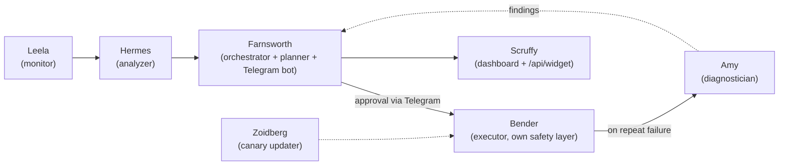

# Planet Express

A self-hosted sysadmin agent for a Docker Compose homelab: it watches your stacks, diagnoses real
failures, proposes and (with your approval) executes fixes, canary-updates images with automatic
rollback, and talks to you over Telegram.

**Status: v1.0.0, first tagged release.** This project started as a bespoke agent running on one
person's home server, hardcoded to that host. It's now generalized into something anyone with
their own Compose-based homelab can install — see [CHANGELOG.md](CHANGELOG.md) for the full spec
history. It is dogfooded on the author's own fleet from day one of that rework, not developed in
isolation and thrown over the wall.

## What it does

Five roles, one per pipeline stage (yes, they're Futurama-named — see below):

- **Leela** (monitor) — collects container health, disk usage, mount status, and journal errors.
  No LLM call; pure data collection.
- **Hermes** (analyzer) — turns Leela's snapshot into severity-ranked findings.
- **Farnsworth** (orchestrator + planner + bot) — runs the pipeline on a schedule, turns findings
  into concrete remediation plans with rollback steps, and is the Telegram bot that asks for your
  approval before anything executes.
- **Bender** (executor) — runs one approved plan's steps in order, hard-stops on the first
  failure. Has its own independent safety layer (forbidden commands, forbidden stacks, a
  network-stack guard) that doesn't trust the plan alone.
- **Amy** (diagnostician) — only runs after a normal remediation has already failed once; digs
  into logs and, when useful, searches the web for a documented fix. Never executes anything
  itself.

Plus a canary auto-updater (**Zoidberg**) that updates one service at a time, watches it, and rolls
back automatically if it doesn't come up healthy.

There's also a read-only web dashboard (**Scruffy**) for a glance-and-go status view, and a
`/api/widget` JSON endpoint for embedding that status in a [Homepage](https://gethomepage.dev)
dashboard.

## Architecture

Findings flow left to right through the pipeline; only Bender ever touches the host. Plans that
come out of a Hermes finding go through Farnsworth's explicit Telegram approval before Bender runs
them. Two things are automated by design and only notify you afterward, not before: Zoidberg's
canary image updates (bounded by its own watch-and-rollback logic) and safe-prune (only runs when
disk pressure is real and every container is in a known-safe state). Both still go through
Bender's independent safety layer either way.

*Screenshots (Telegram approval flow, dashboard) — not yet added; pending a capture pass against a
live install.*

## What's tested, what isn't

CI (`.github/workflows/ci.yml`) runs `ruff check .` and the full pytest suite on every push/PR,
Python 3.11 and 3.12. That test suite is **pure-logic only**: state-schema round-trips, safety-check
allow/deny rules, notifier/dashboard/template rendering against faked collaborators — no real
Docker daemon, sudo, or systemd involved anywhere in it.

What CI does **not** cover, because it can't be tested in good faith without a real host:
actual container start/stop/restart behavior, the sudo-scoped commands Bender runs, systemd unit
installation, and the Telegram bot's live message flow. Those are verified manually against a real
homelab before every release — see the pre-release checklist below — not implied to be covered by
the green CI badge.

### Manual pre-release checklist

- `bash deploy.sh` on a clean checkout — venv, systemd units, sudoers.d grant all render correctly.
- Full pipeline run (Leela → Hermes → Farnsworth) against a real Compose stack with at least one
  induced failure (e.g. a stopped container) — confirm a real finding and a real plan.
- Approve a plan over Telegram, confirm Bender executes it and the fix actually lands.
- Trigger Amy by letting a remediation fail once — confirm it diagnoses without executing anything.
- Zoidberg canary-update pass on a throwaway service — confirm rollback on an induced unhealthy
  start.
- Dashboard (Scruffy) loads and `/api/widget` returns valid JSON a Homepage instance can render.

## Why Futurama names

The pipeline stages map onto the crew: Leela keeps watch, Hermes files the paperwork, Farnsworth
gives the orders (and holds the checkbook — nothing executes without his, i.e. your, approval),
Bender does the actual work, Amy figures out what's really wrong when the first fix doesn't stick.
It's stuck around because it's a genuinely useful mental model for what each stage is responsible
for, not just a joke.

## Project status

This repo was built out in small, independent specs rather than one big rewrite — see
`CLAUDE.md` for the standing engineering process (including an independent second-review gate) and
[CHANGELOG.md](CHANGELOG.md) for the full history. `git clone` + `bash deploy.sh` is a real install
path — see [INSTALL.md](INSTALL.md) for the full walkthrough, including how to get a Telegram bot
token and what the optional sudo grant is for.

## License

MIT — see [LICENSE](LICENSE).
