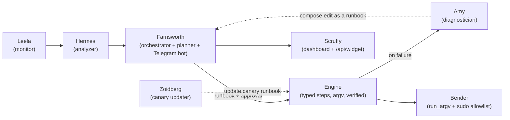
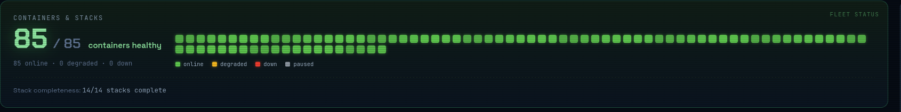
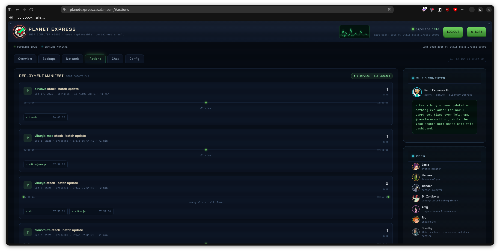
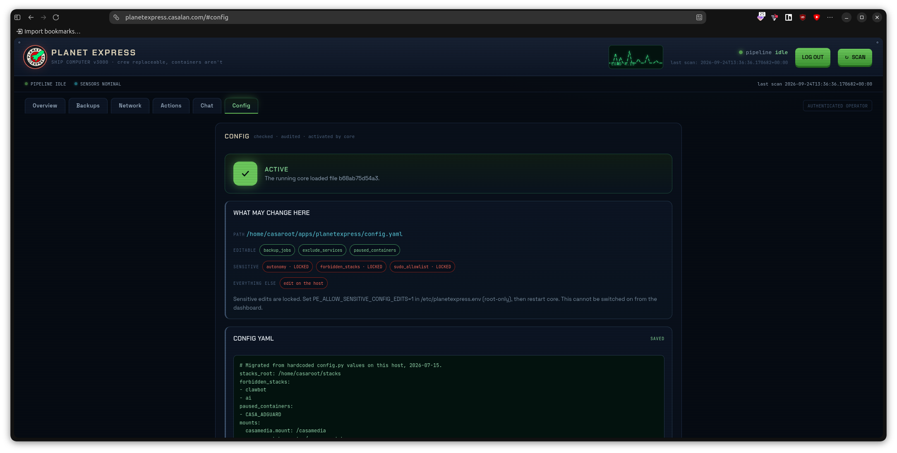
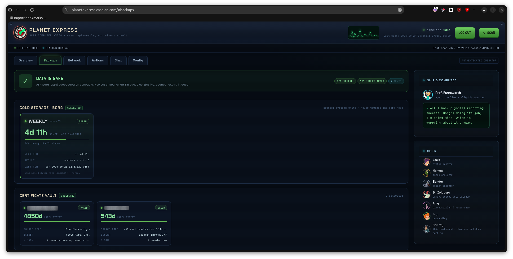
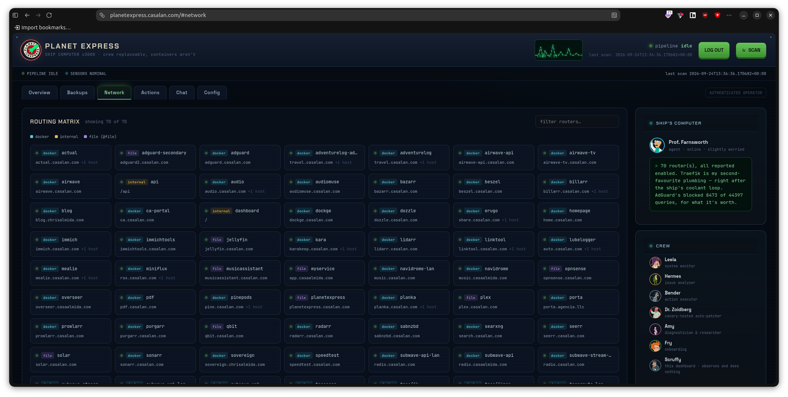
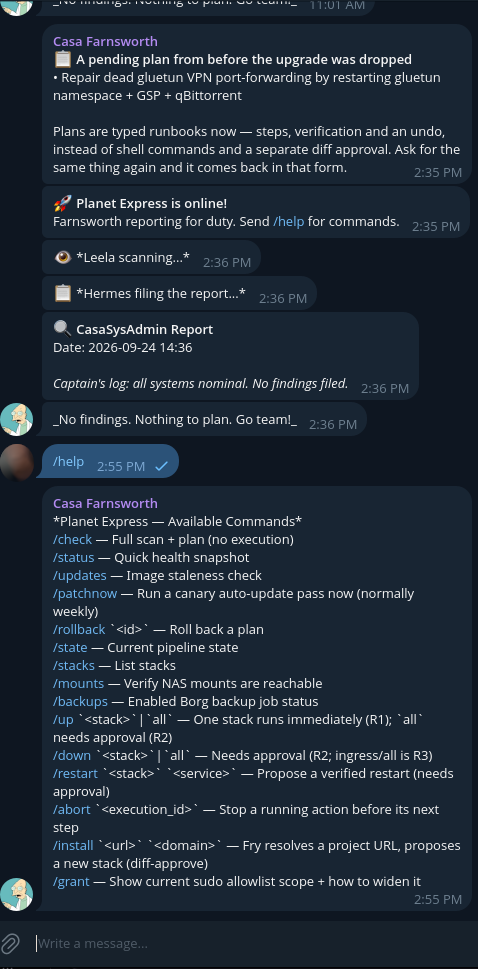

# Planet Express

A self-hosted sysadmin agent for a Docker Compose homelab: it watches your stacks, diagnoses real
failures, proposes and (with your approval) executes fixes, canary-updates images with automatic
rollback, and talks to you over Telegram.

**Status: v2.1.0.** This project started as a bespoke agent running on one person's home server,
hardcoded to that host. It's now generalized into something anyone with their own Compose-based
homelab can install — see [CHANGELOG.md](CHANGELOG.md) for the full spec history, starting with
v1.0.0's first tagged release. It is dogfooded on the author's own fleet from day one of that
rework, not developed in isolation and thrown over the wall.

**What 2.0 changed:** an LLM used to write shell commands, which a pattern-matching safety check
tried to vet before running them through a shell. It no longer does. Every change to the host is
now a **typed step** chosen from a fixed catalogue: its parameters are validated by a schema, its
target is resolved when the plan is proposed and re-checked immediately before it acts, it runs as
an argv list with no shell anywhere, and whether it worked is decided by reading the host — not by
an exit code. A model picks *which* step to run; it never writes what runs.

## What it does

Six roles (yes, they're Futurama-named — see below), plus the execution engine they all go through:

- **Leela** (monitor) — collects container health, disk usage, mount status, and journal errors.
  No LLM call; pure data collection.
- **Hermes** (analyzer) — turns Leela's snapshot into severity-ranked findings.
- **Farnsworth** (orchestrator + planner + bot) — runs the pipeline on a schedule, turns findings
  into **runbooks** built from the step catalogue, and is the Telegram bot that asks for your
  approval before anything executes. If a finding can't be expressed as catalogue steps, it says so
  and hands you the diagnosis instead of inventing a command.
- **Bender** (execution primitives) — the argv runner everything goes through, plus the sudo
  allowlist that fails closed on any `sudo` outside a declared
  `sudo systemctl start|stop|restart <unit>` grant. It no longer executes plans; the engine does.
- **The engine** (`planet_express/execution/`) — runs an approved runbook step by step under a
  host-mutation lock: re-resolves each step's binding, refuses on drift, records what the host
  looked like before it acted, verifies afterwards, and can abort mid-run or roll back what it
  applied.
- **Amy** (diagnostician) — only runs after a remediation has already failed once; digs into logs
  and, when useful, searches the web for a documented fix. She never executes anything: a compose
  edit she proposes becomes its own runbook with its own approval.

Plus a canary auto-updater (**Zoidberg**) that updates one service at a time, watches it, and rolls
back automatically if it doesn't come up healthy.

There's also a web dashboard (**Scruffy**) with Overview, Backups, Network, Actions, History, Chat
and Config tabs — fleet/container health, Borg backup and cert status, live Traefik router and
AdGuard stats, and a live view of each execution's steps with ABORT and ROLL BACK. **Actions holds
only what wants a decision from you** — approvals, open incidents, and canary rollback windows that
may still need settling; anything you can merely read about went to History. Plus a
`/api/widget` JSON endpoint for embedding that status in a [Homepage](https://gethomepage.dev)
dashboard. It runs as its own unix user that cannot read the core's database; everything it shows
or requests goes over an RPC socket, and every mutation still needs the same approval a Telegram
request would.

## Architecture

```mermaid
flowchart LR
    Leela["Leela\n(monitor)"] --> Hermes["Hermes\n(analyzer)"]
    Hermes --> Farnsworth["Farnsworth\n(orchestrator + planner + Telegram bot)"]
    Farnsworth -- "runbook + approval" --> Engine["Engine\n(typed steps, argv, verified)"]
    Engine -- "on failure" --> Amy["Amy\n(diagnostician)"]
    Amy -. "compose edit as a runbook" .-> Farnsworth
    Zoidberg["Zoidberg\n(canary updater)"] -. "update.canary runbook" .-> Engine
    Engine --> Bender["Bender\n(run_argv + sudo allowlist)"]
    Farnsworth --> Scruffy["Scruffy\n(dashboard + /api/widget)"]
```

Findings flow left to right; only the engine ever changes the host, and only from a runbook that
was approved. Each step carries the binding it was approved against, so a compose file edited or a
container recreated between approval and execution fails the step instead of acting on something
else. Risky classes need your approval; exactly two things are automated by design and notify you
afterward rather than before: Zoidberg's canary image updates (pinned to the image the plan
resolved, watched, and automatically rolled back if the service doesn't stay healthy) and
safe-prune (only when disk pressure is real, every container is in a known-safe state, and no
canary rollback window is open). That exemption is keyed to those two step types and to an origin
assigned by server code — never to anything a model wrote.

*Fleet status on the Overview tab. Every container's health is collected by Leela on a schedule —
no LLM involved in gathering any of it.*

### The rest of the dashboard

<table>
<tr>
<td width="50%"> <b>Actions</b> — only what wants a decision: approvals, open incidents, and canary rollback windows still to settle.</td>
<td width="50%"> <b>Config</b> — edit config.yaml with a compare-and-swap save. Sensitive keys are locked and can only be unlocked on the host, never from here.</td>
</tr>
<tr>
<td width="50%"> <b>Backups</b> — Borg job status and the certificate vault.</td>
<td width="50%"> <b>Network</b> — live Traefik routers and AdGuard stats, polled with short timeouts that degrade rather than fail.</td>
</tr>
</table>

### Telegram

Farnsworth reports scans, asks for approval before anything runs, and answers `/help`. The notice
at the top of that conversation is the 2.0 upgrade doing what it should: a plan left pending by the
old shell-command flow can't be run any more, so it says so once, names what it was, and retires it
rather than leaving a button that quietly does nothing.

## What's tested, what isn't

CI (`.github/workflows/ci.yml`) runs `ruff check .` and the full pytest suite on every push/PR,
Python 3.11 and 3.12. That test suite is **pure-logic only**: state-schema round-trips, policy and
allowlist rules, engine behaviour against a faked host, notifier/dashboard/template rendering — no
real Docker daemon, sudo, or systemd involved anywhere in it.

What CI does **not** cover, because it can't be tested in good faith without a real host: actual
container start/stop/restart behaviour, the sudo-scoped commands, compose writes, canary updates
against a real registry, systemd unit installation, and the Telegram bot's live message flow.
Those are rehearsed on a **throwaway KVM guest shaped like the real host** (`tests/homelab/`)
before anything is deployed — fixture stacks that are healthy, unhealthy, crash-looping and
slow-starting, plus a local registry serving a good and a deliberately broken image tag. Each
landing has a rehearsal script there. Several of the bugs in the changelog were found that way and
nowhere else, which is the point: a green CI badge is not a claim about the host.

### Manual pre-release checklist

- `bash deploy.sh` on a clean checkout — venv, systemd units, sudoers.d grant all render correctly.
- Full pipeline run (Leela → Hermes → Farnsworth) against a real Compose stack with at least one
  induced failure (e.g. a stopped container) — confirm a real finding and a real runbook.
- Approve that runbook over Telegram; confirm each step is verified from host state and the card
  shows what actually happened, step by step.
- Run `/restart <stack> <service>`, approve its card, and confirm success is reported only after
  the post-restart health verification passes.
- Edit the compose file between proposing a plan and approving it — confirm the step refuses on
  drift instead of acting on the changed file.
- Abort a multi-step run mid-flight, and roll back a finished one; confirm the undo only reverses
  steps that actually changed something.
- Trigger Amy by letting a remediation fail once — confirm she diagnoses without executing, and
  that any compose edit she proposes arrives as its own approval.
- Zoidberg canary-update pass on a throwaway service — confirm the automatic rollback on an
  induced unhealthy start, and that the old image is held back from pruning until it resolves.
- Dashboard (Scruffy) loads, an execution's steps stream live, and `/api/widget` returns valid JSON
  a Homepage instance can render.

## Why Futurama names

The pipeline stages map onto the crew: Leela keeps watch, Hermes files the paperwork, Farnsworth
gives the orders (and holds the checkbook — nothing executes without his, i.e. your, approval),
Bender does the actual work, Amy figures out what's really wrong when the first fix doesn't stick.
Bender's job got narrower in 2.0 — he runs the commands, he no longer decides what they are — which
is arguably truer to the character.
It's stuck around because it's a genuinely useful mental model for what each stage is responsible
for, not just a joke.

## Project status

This repo was built out in small, independent specs rather than one big rewrite — see
`CLAUDE.md` for the standing engineering process (including an independent second-review gate that
every slice goes through) and [CHANGELOG.md](CHANGELOG.md) for the full history. The 2.0 rework
landed as five slices, each one deployed to a real host and soaked before the next began. `git clone` + `bash deploy.sh` is a real install
path — see [INSTALL.md](INSTALL.md) for the full walkthrough, including how to get a Telegram bot
token and what the optional sudo grant is for.

## License

MIT — see [LICENSE](LICENSE).
